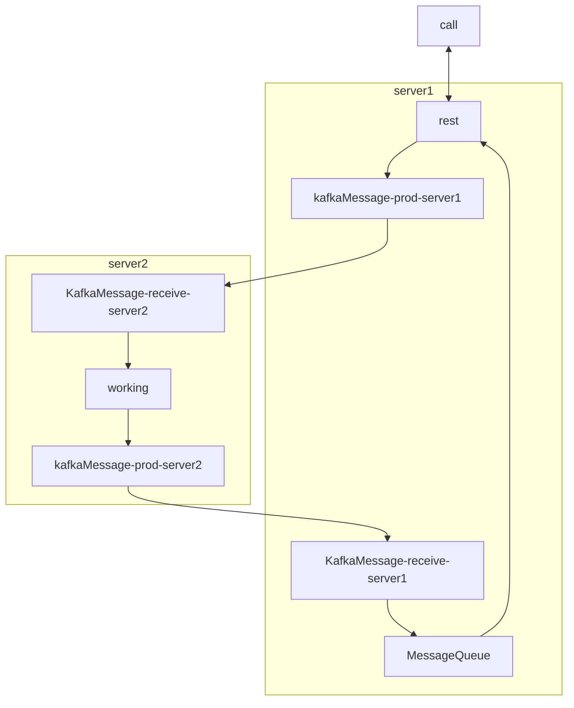

# rest-kafka-demo

Process overview

```mermaid
flowchart TB
    call<-->rest
    subgraph server1
    rest--> kafkaMessage-prod-server1
    KafkaMessage-receive-server1-->MessageQueue
    MessageQueue --> rest
    end
    subgraph server2
    kafkaMessage-prod-server1 --> KafkaMessage-receive-server2
    KafkaMessage-receive-server2-->working 
    working --> kafkaMessage-prod-server2
    kafkaMessage-prod-server2 --> KafkaMessage-receive-server1
    end
```

To run 
compile.sh - npm install and tsc 
run-server1.sh - run server 1 
run-server2.sh - run server 2 

test.sh - send REST request to server 1 
